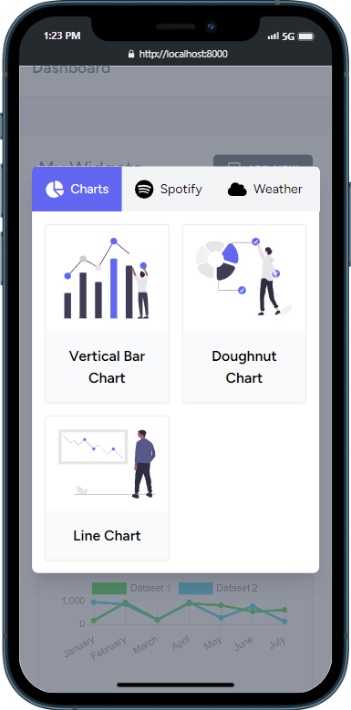

<p align="center"><a href="https://laravel.com" target="_blank"></a></p>
<h1 align="center">Customizable Dashboard</h1>

## About This Project

Customizable Dashboard is a Laravel project that allows you to add, position, and delete Widgets in your Dashboard.

## Project Structure

This project is bootstrapped with Laravel, and Laravel Inertia (React and Typescript). You may read about the structure in the [Laravel documentation](https://laravel.com/docs/11.x/structure).

-   `/app`: Core code of the application (includes models, controllers, and providers). The `Widgets/WidgetController.php` file handles the logic to create, move and delete a user's widgets from the database.
-   `/database`: Database migrations, factories, and seeders. Also contains the SQLite database, should you choose to use SQLite.
-   `/routes`: The routes for the application. The routes for managing the widgets is in the `web.php` file.
-   `/resources`:
    -   `/resources/js/Pages/Dashboard` folder contains most of the frontend logic for this application.
    -   `/resources/js/hooks` folder contains the custom React hooks.
    -   `/resources/js/redux` folder contains the Redux logic.

## How to Run

### Prerequisites

-   Node.js and NPM: Ensure you have Node.js and NPM installed. You can download and install them from [nodejs.org](https://www.nodejs.org).
-   Composer: Composer is required for managing PHP dependencies. You can download and install it from [getcomposer.org](https://getcomposer.org).
-   PHP: Make sure you have PHP version 8.2 or higher installed, since Customizable Dashboard uses Laravel 11. You can download the latest version from [php.net](https://php.net).

### Installation

1. Clone the repo:
    ```sh
    git clone https://github.com/anthonytoumaibrahim/customizable-dashboard.git
    ```
2. Navigate to the project repository:
    ```sh
    cd customizable-dashboard
    ```

### Setup

1. Install Node dependencies:

    ```sh
    npm install
    ```

2. Install Composer dependencies:
    ```sh
    composer install
    ```
3. Copy the example environment variables file `.env.example` and rename it as `.env`, either manually or through this command:
    ```sh
    cp .env.example .env
    ```
4. Fill out the information in `.env` with your configuration details, including the database connection settings. You may use SQLite with this project if you desire.

5. Run the migrations:
    ```sh
    php artisan migrate
    ```
6. To start the application, you need to run both of these commands (run each one in a separate terminal):
    ```sh
    php artisan serve
    npm run dev
    ```

## Usage

This section details how to use the application, after you set up the project locally.

To use this application, simply create or login to an existing account, after which you will be redirected to the dashboard. Once you're in the dashboard, you can click on the button to the right, labelled "Add New", to create and add widgets to your dashboard:

| New Widget Popup                     | Customize Chart                                  |
| ------------------------------------ | ------------------------------------------------ |
|      |  |
| Dashboard                            |
|  |

This application is also optimized for mobile:

| New Widget Popup                           | Dashboard                                   |
| ------------------------------------------ | ------------------------------------------- |
|  |  |
